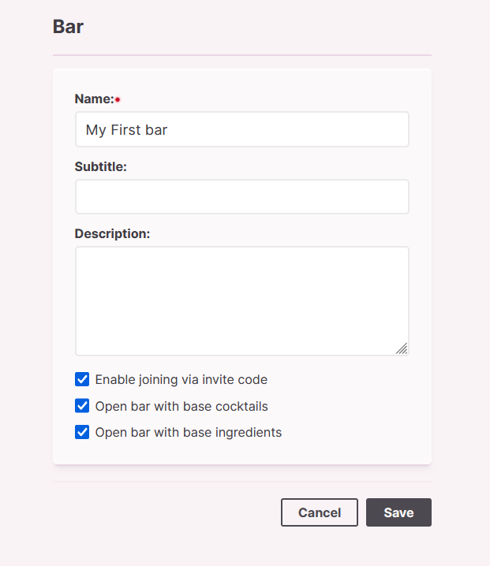
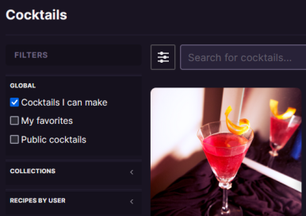

---
hide:
  - navigation
---

# Usage

Here you can find some information about using some of the Bar Assistant features.

## Installation

Visit [setup page](setup/index.md) to view installation steps.

## Initial bar data

<!-- { align=left } -->

When you create a new bar, you can choose to start a bar with cocktails and ingredients already included. All that initial data is managed in a separate repository and pulled when building a docker image. You can view and contribute to that data via the [Bar Assistant Public Data repository](https://github.com/bar-assistant/data). Standard recipe repository usually gets updates with new recipes, to pull new recipes you can go to: "Bars" -> "Edit bar" and click on "Synchronize data".

## Showing what recipes you can make

<!-- { align=left } -->

All cocktails that you can make and ingredients that you have are managed via "Shelf". To see what recipes you can make you need to add all ingredients that you have to your shelf.

1. Go to "Ingredients" page
2. Search or create an ingredient that you want to add to your shelf
3. Click "Add to shelf" action
4. Go to "Cocktails" page
5. In filters check "Cocktails I can make" checkbox

### Controlling ingredient matching

You can increase your available cocktail recipes in a few ways.

- You can edit cocktail recipes to include substitutes for specific ingredients. So if you have any of the substitute ingredients they will show up in your shelf.
- Use the "Optional" checkbox for specific ingredients. These cocktail ingredients will be ignored when matching your shelf ingredients.
- Enable "Track parent ingredient as a substitute ingredient in your shelf" in your profile. You can edit a specific ingredient to be a parent of some generic ingredient. This will match all ingredients that are related, for example, if "Scotch Whiskey" is a child ingredient of "Whiskey", it will try to match both of them.

## Adding recipes

You can create new cocktail recipes by clicking "Create cocktail" button on "Cocktails" page. From that page you can manage all data related to the recipe including ingredients, tags, images and more.

You can also import recipes through various sources. If you are missing some import options you can open a [GitHub issue](https://github.com/karlomikus/bar-assistant) and describe what would you want to be added.

### Import from website

With Bar Assistant you can scrape cocktail recipes directly from the given webpage. Some websites are officially supported but Bar Assistant will try to extract recipe data from any link you give it.

After you import recipe from the URL you will be presented with all the data that was found. Here you can double-check if everything is correct and keep it in sync with your data. Ingredients will be automatically matched by their name, if the ingredient is not found it will be created. You can also manually match ingredients.

## Recipe collections

You can create a recipe collection in a few ways.

By manually creating collections via the "Collections" page. Then you can go to a single cocktail recipe and in the actions dropdown select "Add to collection". You can also create a new collection directly from dialog that shows up.

To add multiple recipes to collection you can use "Cocktails" page to filter what cocktails you want to add and then click "Add to collection" button in top right.

If you want to share your collection with all the members in the bar you can enable that on "Collections" page when you edit a specific collection. All shared collections will be shown in the filter sidebar od "Cocktails" page.

## Searching and filtering

You can use global search that is always available when you click "Search" in site header. This search is fast and powered by Meilisearch. From here you can also filter ingredients and cocktails.

You can also be more specific with filters when you are on main resource page.

Available cocktail filters:

- Cocktails you can make
- Favorites
- Cocktails with a public link
- Collections - including your and other bar members collections
- Recipes added by specific users
- Main ingredient - The ingredient that is in first place in the cocktail recipe is marked as the main ingredient
- Cocktail preparation method
- Cocktail strength by ABV
- Custom tags you've added
- Glass type
- Total number of ingredients
- By ratings

Available ingredient filters:

- Ingredients in your shelf
- Ingredients on your shopping list
- Ingredients used as main ingredient
- Category
- Strength

These facets combined with custom sorting give you powerful filtering capabilities.

## Sharing recipes

Bar Assistant allows you to share recipes in a few ways. All actions are available on a specific cocktail recipe page.

- Print recipe - This shows you print-friendly page with the recipe information
- Create public link - This will create a public link which you can share with your friends
- Generate recipe image - Create a recipe image that you can share with your friends
- Copy as JSON - This will copy recipe in a specific format which you can use to import it into another bar
- Copy as YAML/XML/Markdown/JSON-LD - This will copy recipe information in selected format

## User roles

There is a few user roles in the Bar Assistant.

**Admin**

Complete access to bar actions. Can't delete the bar.

**Moderator**

Can manage cocktails and ingredients. Can manage bar settings except bar members.

**General**

Can manage cocktails and ingredients.

**Guest**

Can only view, favorite and rate recipes and ingredients. Can also create collections.

**Bar owner**

User that created the bar.

**Bar member**

User that has any membership in the bar.

!!! warning

    Keep in mind that the user that created the bar can delete it at any point (independent of the role he has). Deleting the bar also deletes all the recipes and ingredients that members added.

### Bar

| Action | Allowed roles |
| --- | --- |
| Create | Anyone registered |
| View | Bar members |
| Edit | Bar owner, admin |
| Delete | Bar owner |
| Remove members | Bar owner, admin |
| Active/Deactivate | Bar owner |
| Create exports | Bar owner |
| Manage bar shelf | Bar owner, admin, moderator |

### Methods, Tags, Utensils, Ingredient categories, Glass types, Price categories

| Action | Allowed roles |
| --- | --- |
| Create | Admin, moderator |
| View | Bar members |
| Edit | Admin, moderator |
| Delete | Admin, moderator |

### Cocktails

| Action | Allowed roles |
| --- | --- |
| Create | Admin, moderator, general |
| View | Bar members |
| Edit | Cocktail author, admin, moderator |
| Delete | Cocktail author, admin, moderator |
| Create public link | Cocktail author, admin, moderator |
| Rate | Bar members |
| Add notes | Bar members |

### Ingredients

| Action | Allowed roles |
| --- | --- |
| Create | Admin, moderator, general |
| View | Bar members |
| Edit | Cocktail author, admin, moderator |
| Delete | Cocktail author, admin, moderator |

### Users

| Action | Allowed roles |
| --- | --- |
| Create | Admin, moderator |
| View | Admin, moderator |
| Edit | Admin, moderator |
| Delete | User can delete his own account |
